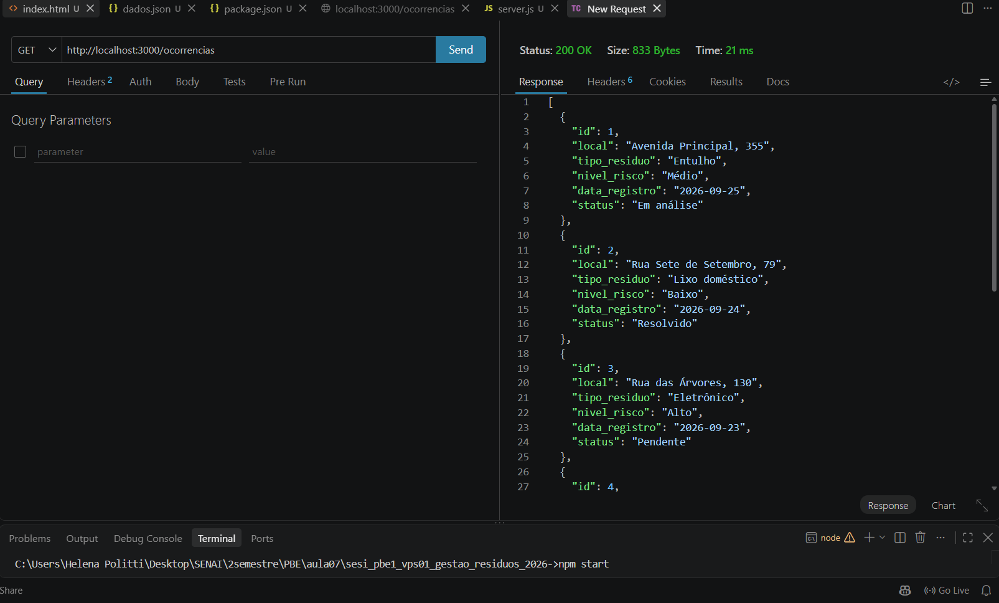
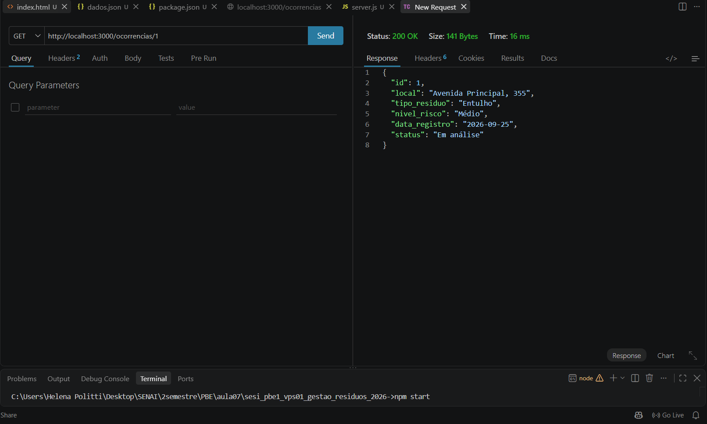
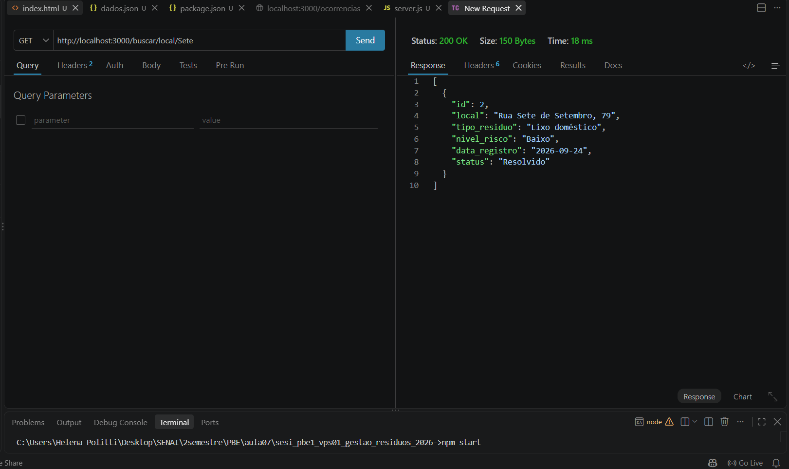
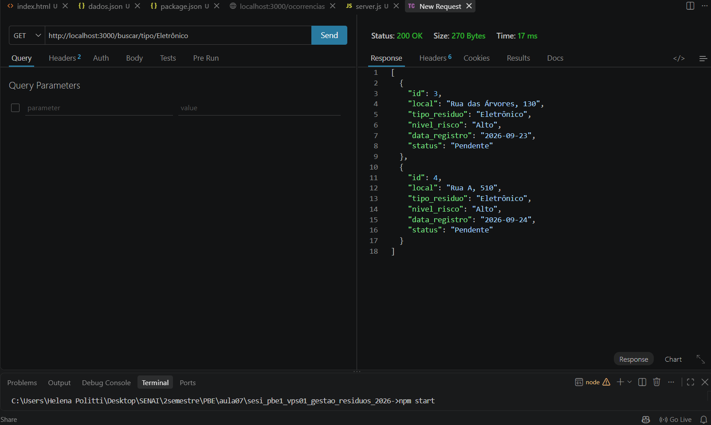
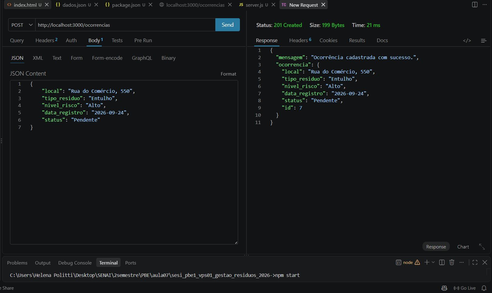
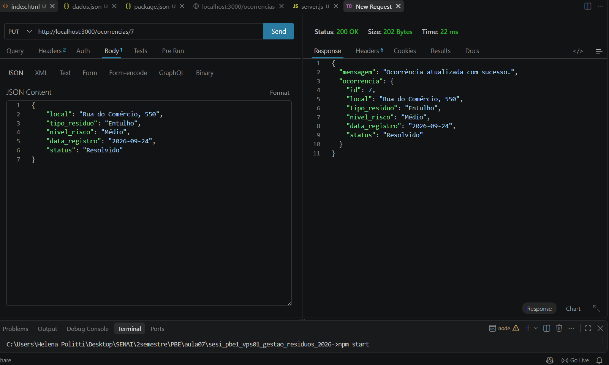
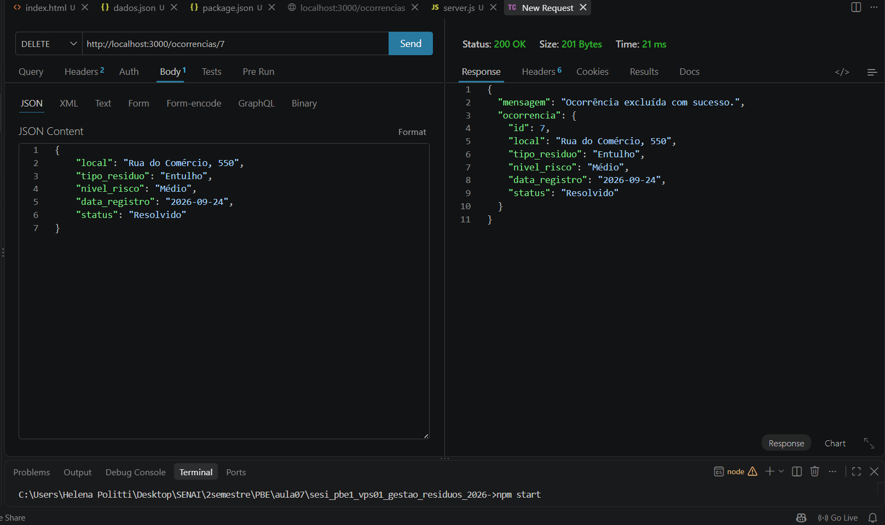
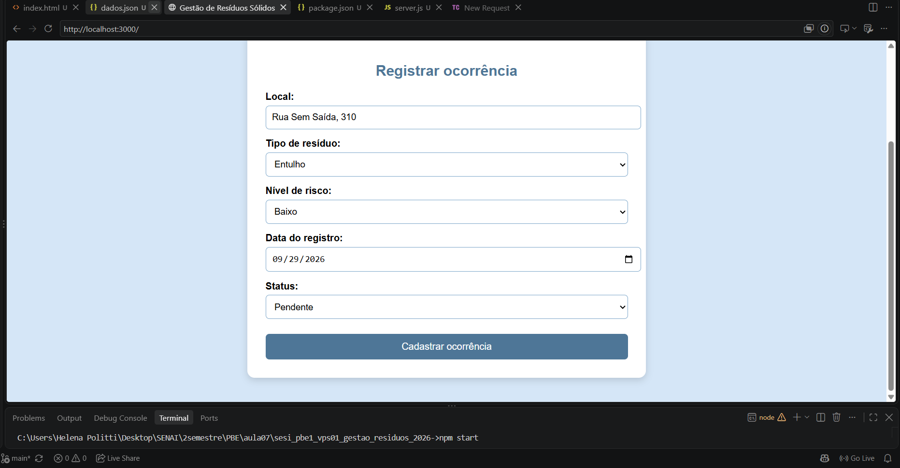

# Gestão de Resíduos Sólidos

## Descrição

Este projeto consiste no desenvolvimento de uma API REST para o monitoramento de pontos de descarte irregular de resíduos sólidos no município de Amparo.

O sistema permite cadastrar, consultar, atualizar e excluir ocorrências relacionadas ao descarte de lixo, entulho e resíduos eletrônicos.

A API utiliza um arquivo JSON como fonte de armazenamento dos dados.

---

## Funcionalidades

* Cadastrar ocorrência de descarte irregular;
* Consultar todas as ocorrências;
* Consultar ocorrência por ID;
* Buscar ocorrências por local;
* Buscar ocorrências por tipo de resíduo;
* Atualizar uma ocorrência;
* Excluir uma ocorrência;
* Gerar o ID automaticamente durante o cadastro.

---

## Tecnologias

* Node.js
* JavaScript
* Express
* JSON
* HTML
* Thunder Client
* Visual Studio Code
* Git e GitHub

---

## Estrutura do projeto

```text
├── client/
│   └── index.html
│
├── prints/
│   ├── read_all.png
│   ├── read_id.png
│   ├── buscar_local.png
│   ├── buscar_tipo.png
│   ├── create.png
│   ├── update.png
│   └── delete.png
│   └── formulario.png
│   └── formulario_result.png
│
├── .gitignore
├── dados.json
├── package.json
├── README.md
└── server.js
```

---

## Como executar o projeto

### 1. Clonar o repositório

```bash
git clone URL_DO_REPOSITORIO
```

### 2. Entrar na pasta

```bash
cd sesi_pbe1_vps01_gestao_residuos_2026
```

### 3. Instalar as dependências

```bash
npm install
```

### 4. Iniciar o servidor

```bash
npm run dev
```

O servidor será executado em:

```text
http://localhost:3000
```

---

## Rotas da API

### Consultar todas as ocorrências

```http
GET /ocorrencias
```

Exemplo:

```text
http://localhost:3000/ocorrencias
```

### Consultar por ID

```http
GET /ocorrencias/:id
```

Exemplo:

```text
http://localhost:3000/ocorrencias/1
```

### Buscar por local

```http
GET /buscar/local/:local
```

Exemplo:

```text
http://localhost:3000/buscar/local/Sete
```

### Buscar por tipo de resíduo

```http
GET /buscar/tipo/:tipo
```

Exemplo:

```text
http://localhost:3000/buscar/tipo/Eletrônico
```

### Cadastrar ocorrência

```http
POST /ocorrencias
```

Exemplo de requisição:

```json
{
    "local": "Rua do Comércio, 550",
    "tipo_residuo": "Entulho",
    "nivel_risco": "Alto",
    "data_registro": "2026-09-24",
    "status": "Pendente"
}
```

### Atualizar ocorrência

```http
PUT /ocorrencias/:id
```

Exemplo:

```text
http://localhost:3000/ocorrencias/1
```

Body:

```json
{
    "local": "Rua do Comércio, 550",
    "tipo_residuo": "Entulho",
    "nivel_risco": "Médio",
    "data_registro": "2026-09-24",
    "status": "Resolvido"
}
```

### Excluir ocorrência

```http
DELETE /ocorrencias/:id
```

Exemplo:

```text
http://localhost:3000/ocorrencias/1
```

---

## Testes realizados

Os testes foram realizados utilizando o Thunder Client.

### GET — Todas as ocorrências



### GET — Consulta por ID



### GET — Busca por local



### GET — Busca por tipo de resíduo



### POST — Cadastro de ocorrência



### PUT — Atualização de ocorrência



### DELETE — Exclusão de ocorrência



---

## Formulário

O projeto também possui um formulário HTML para cadastro de novas ocorrências.



---

## Projeto

Projeto desenvolvido como atividade da disciplina de Programação Back-End.

**VPF01 — Aula 07**

**Tema 01 — Gestão de Resíduos Sólidos**
